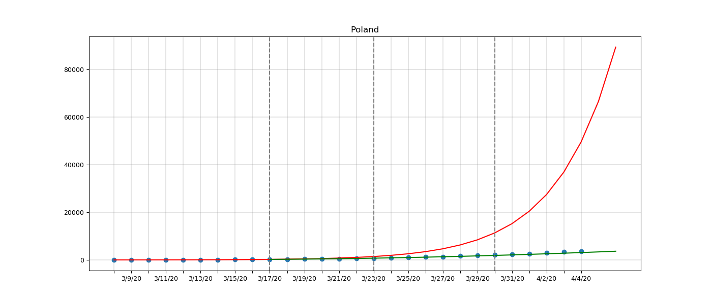

####The number of registered COVID-19 infections in Poland and prognosis.

BLUE - real data from [CSSEGI](https://github.com/CSSEGISandData/COVID-19)

RED - estimated exponential virus expansion when no measures taken

GREEN - estimated actual expansion.

GRAY LINE - the moment a few days after the measures such as social isolation, school and entertainment closures were introduced 

